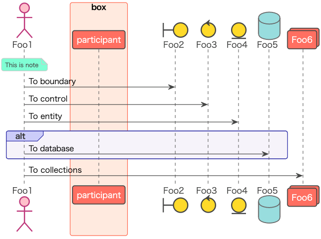
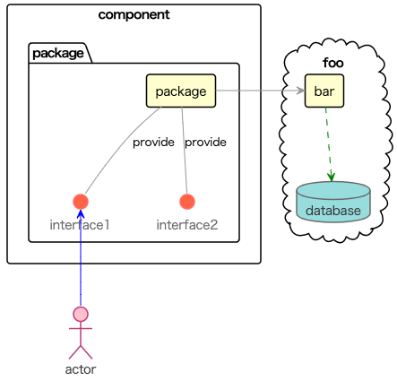
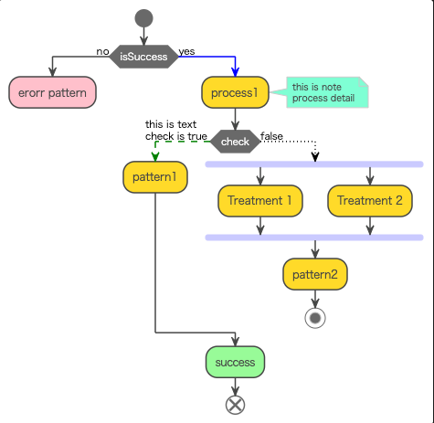

# plantuml-theme

PlantUML theme

## Usage

Write `!include <This repository plantuml path>` between @startuml and @enduml block.

### Example sequence

Use the theme from your sequence diagram:

```
@startuml 
!include https://raw.githubusercontent.com/cos31/plantuml-theme/main/themes/sequence.plantuml

actor Foo1
box box
    participant "participant"
end box
boundary Foo2
control Foo3
entity Foo4
database Foo5
collections Foo6
note over Foo1: This is note
Foo1 -> Foo2 : To boundary
Foo1 -> Foo3 : To control
Foo1 -> Foo4 : To entity
alt
   Foo1 -> Foo5 : To database
end 
Foo1 -> Foo6 : To collections

@enduml
```

Output is bellow.




### Example component

Use the theme from your component diagram:

```
@startuml 
!include https://raw.githubusercontent.com/cos31/plantuml-theme/main/themes/component.plantuml
skinparam ArrowColor<<DB>> Green
skinparam ArrowColor<<actor>> Blue

actor actor

Cloud "foo" {
    [bar]
    database database
    [bar] ..> database <<DB>>
}

component "component" {
    package "package" {
        interface "interface1"
        interface "interface2"

        interface1  -up- [package]: provide
        interface2  -up- [package]: provide
    }
}
actor -up-> interface1  <<actor>>
package -> bar


@enduml
```

Output is bellow.




### Example Actibity

Use the theme from your Actibity diagram:

```
!include https://raw.githubusercontent.com/cos31/plantuml-theme/main/themes/activity.plantuml

start
if (isSuccess) then (no)
    #pink:erorr pattern;
    kill
else 
    -[#blue]-> yes;
    :process1;
    note right: this is note\nprocess detail

    if (check) then (yes)
        -[#green,dashed]-> this is text\ncheck is true ;
        :pattern1;
    else (false)
        -[#black,dotted]->
        fork
            :Treatment 1;
        fork again
            :Treatment 2;
        end fork
        :pattern2;
        stop
    endif

    #palegreen:success;
    end
endif
```



## License
This version of puml-themes is released under the Apache License, Version 2.0 (see [LICENSE](https://github.com/cos31/plantuml-theme/blob/main/LICENSE)).
